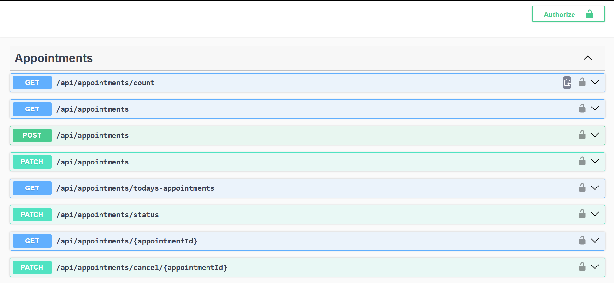
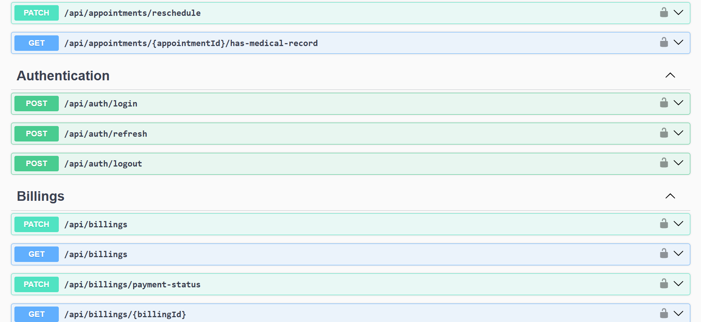
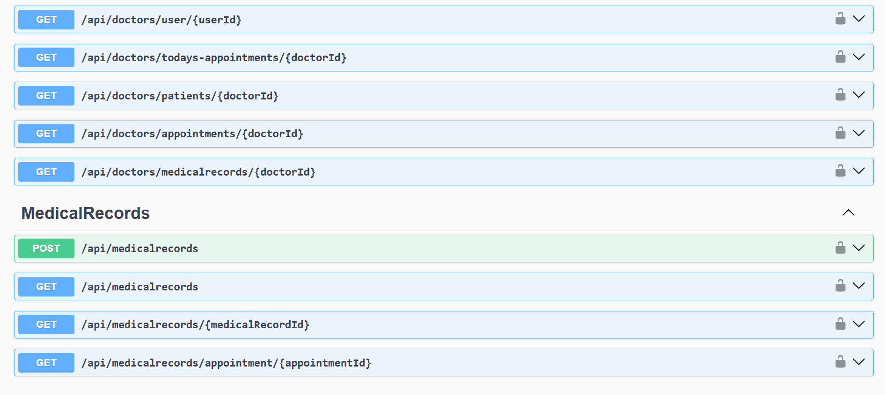
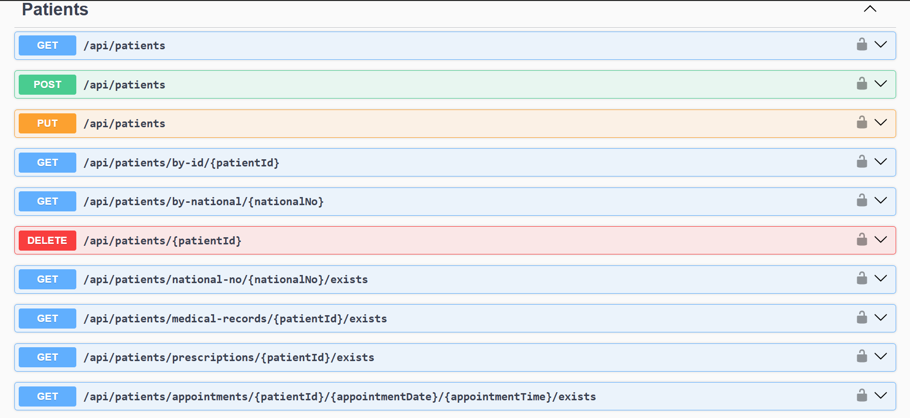
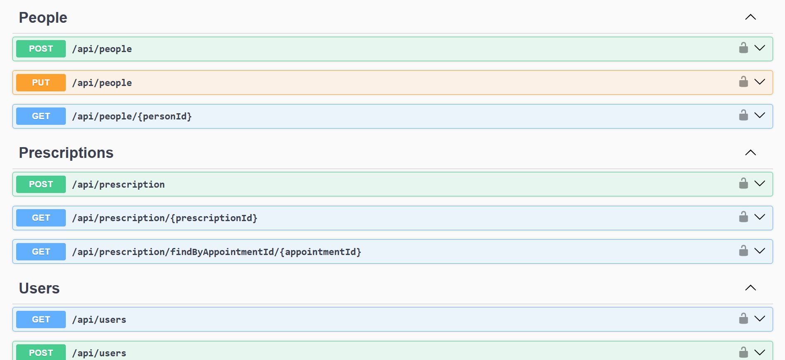
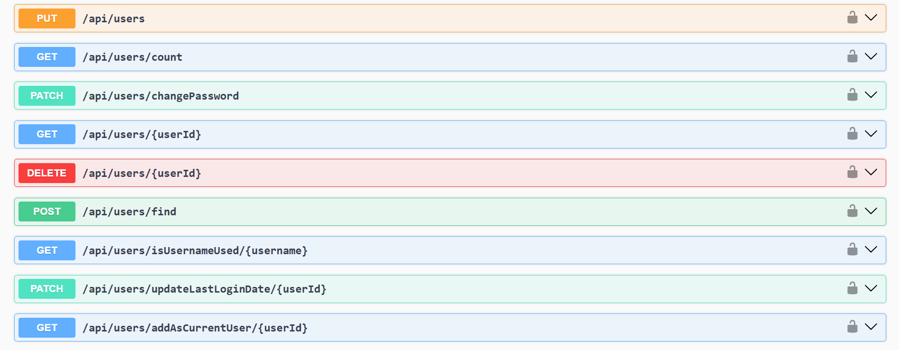

# 📚 Hospital Management System - API
A backend RESTful API built with ASP.NET Core (.NET 8) for managing hospital operations: patients, doctors, appointments, medical records, prescriptions, billing, authentication and authorization.

> 💡 This project is a RESTful Web API for my Hospital Management System.  
> You can view it on my [GitHub Profile](https://github.com/malakmuayad11/Hospital-Management-System).

## ✅ Features
- 🩺 Patient, Doctor, Appointment management
- 🏥 Medical records and prescriptions management
- 💰 Billing and audit trails
- 🔐 JWT authentication and role-based authorization
- 🪪 Ownership and permission-based authorization policies
- 🔄️ Refresh token support (tokens persisted)
- 🗄️ EF Core with SQL Server (DbContext `HospitalSystemContext`)
- 🗝️ Azure Key Vault support for secrets
- 📈 Rate limiting policies for endpoints
- 📃 Swagger/OpenAPI documented endpoints
- 🌐 CORS configured for local clients
- 📊 Simple file-based logging and audit logging

## 🧩 System Architecture
- API Layer: `HospitalSystem.API`
- Business Logic Layer (BAL): `HospitalSystem.Service`
- Data Access Layer (DAL): `HospitalSystem.Repository`, `HospitalSystem.Data`
- Infrastructure (cross-cutting): `HospitalSystem.Infrastructure`, `HospitalSystem.Extensions`

## ⚙️ Technology Stack
- C# / ASP.NET Core (.NET 8)
- Entity Framework Core (SQL Server provider)
- JWT (Microsoft.IdentityModel.Tokens)
- Azure Key Vault integration (optional)
- Rate limiting (built-in ASP.NET Core RateLimiter)
- Swagger (Swashbuckle)

## 🚀 Quick start
1. Clone the repository
   - git clone https://github.com/malakmuayad11/Hospital_System.git
2. Open the solution in Visual Studio (e.g., Visual Studio 2026) or use the CLI.
   - Solution: `HospitalSystem.slnx` (root)
3. Configure settings
   - Edit `appsettings.json` (or set Key Vault secrets):
     - `ConnectionString` → SQL Server connection string
     - `JwtSigningKey` → JWT signing secret
4. Restore the database from the backup file
5. Build and run
   - Visual Studio: Press Start
   - CLI: `dotnet build` then `dotnet run --project HospitalSystem`
6. Open Swagger UI (when running in Development): `https://localhost:{port}/swagger`

## 📸 Screenshots

### 📃 AppointmentsController

### 💰 AuthenticationController + BillingsController

### 📃 ConsultationsController + DoctorsCotnroller

### 🩺 DoctorsController + MedicalRecordsController

### 🏥 PatientsController

### 👥 PeopleController + PrescriptionsController

### 👤UsersController

## 👩‍💻 Author
**Malak Muayad**  
📧 [malakmuayad15@gmail.com](mailto:malakmuayad15@gmail.com)  
🔗 [malakmuayad11](https://github.com/malakmuayad11)
